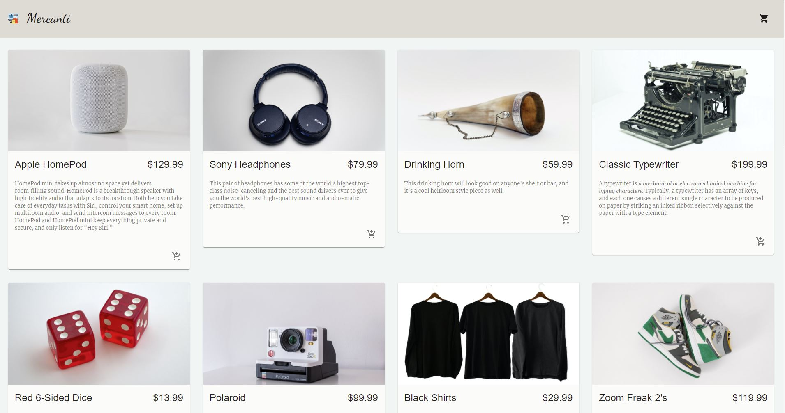

## Mercanti

Beautiful and simple eCommerce site for the sale of second hand products. Name is an ode to the well known market place "Mercari". Built using the Commerce.js API with a minimal and elegant design.

### Built with:

React.js	Commerce.js	Stripe

## Live

<a href='https://mercanti.shop' target='_blank'>Mercanti</a>

## Project Screen Shot

